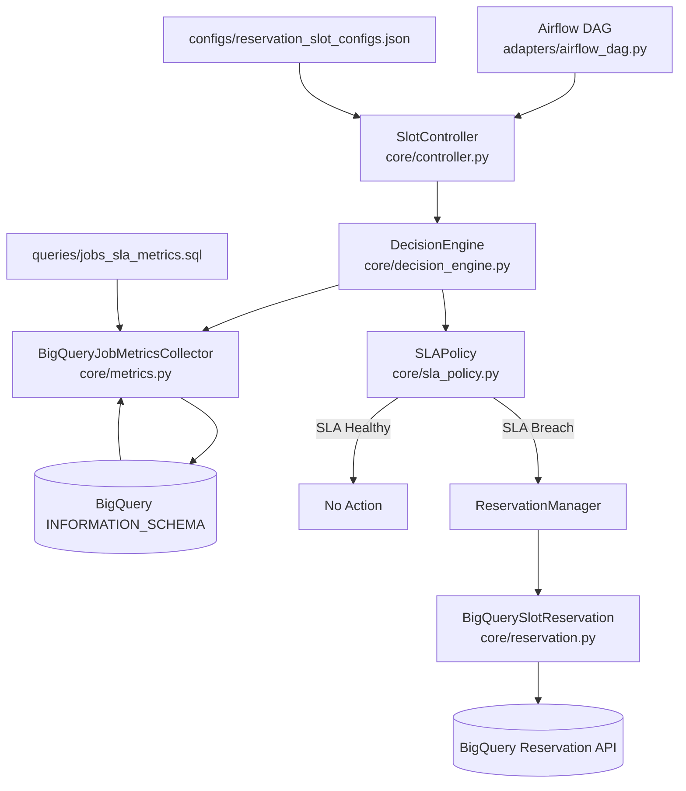
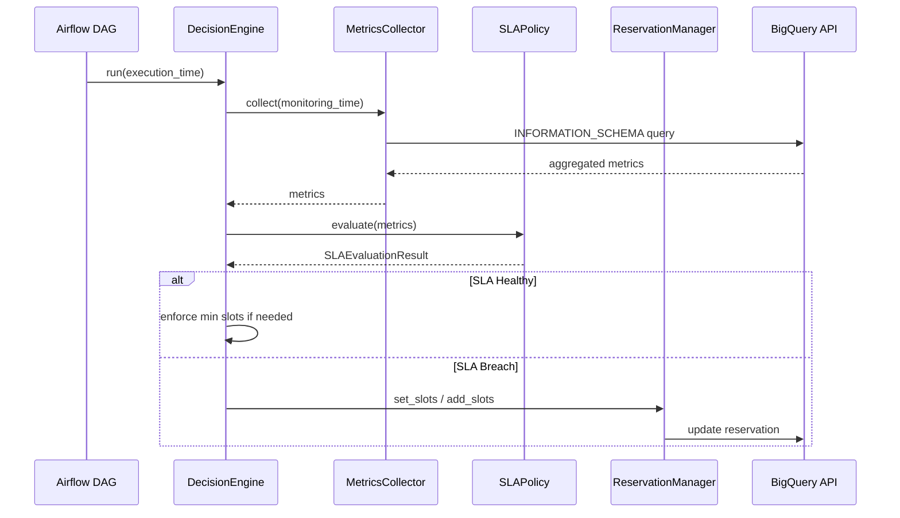

# BigQuery Dynamic Slot Reservation

## Problem Definition

### Bigquery's Cost Inefficiency Due to Autoscaling Cooldown (“Buffer Time”)

A practical limitation of native BigQuery autoscaling is its conservative scale-down behavior. After a burst of heavy queries, reservation slots ramp up quickly, but they scale down slowly due to an internal cooldown period. During this time, unused slots remain allocated and billed.

For workloads with short-lived spikes, periodic batch jobs, or bursty analytical queries, this behavior can lead to systematic over-allocation and inflated costs.

### Real-world Impact Observed

In a previous production environment, this pattern caused:
- Slot reservations to remain elevated long after peak workloads completed
- Daily cost spikes during predictable batch windows
- Limited visibility or control over when scale-down would occur

By monitoring reservation slot usage via Google Cloud Monitoring, we observed that:
- Even after all query jobs had finished, reservation slots remained high for a period of idleness
- This idle allocation directly increased costs, especially at scale — for a company managing hundreds of PBs of analytical data, the financial impact was substantial

### Proposed solution
The pipelines in this repository focus on policy-driven slot controller that:
- Slot capacity was actively brought back down once SLA conditions stabilized
- Scale-down decisions became time-aware and workload-aware

### Measured outcome (pilot phase):
- 5–15% reduction in BigQuery slot reservation costs (observed across multiple projects in Google Cloud)
- Measured over ~1 week of controlled monitoring
- No SLA regressions observed during the pilot

### How Does this mitigate the autoscaling buffer inefficiency
- Enforcing explicit minimum slots only when needed
- Actively reducing max autoscale limits outside peak windows
- Using SLA health as a signal to stop over-provisioning
- Avoiding “set-and-forget” capacity ceilings

## Architecture Overview

This project implements a policy-driven BigQuery slot autoscaling system.
The architecture separates orchestration, decision logic, SLA policy,
metrics collection, and infrastructure APIs for clarity, testability,
and portability across schedulers.

### Architecture Flow

### Decision Engine Sub-Flow

## Considerations & Limitations

### Randomness of Workloads

Query spikes can happen at unpredictable times (e.g., national holidays, ad-hoc analysis, migrations).
This randomness makes purely predictive or ML-based slot forecasting unreliable.

### Policy-Driven Approach Only

The pipeline enforces decisions based on SLA signals and time-of-day heuristics, not predictions.
It actively scales down after periods of low usage and avoids over-provisioning, but cannot preemptively predict rare spikes.

### Scope of Slot Adjustment

Currently, the system only adjusts max autoscaling slots of a single reservation.
Multi-reservation or cross-project coordination is not handled yet.

### Reliance on Metrics Availability

Accurate decision-making depends on timely and correct metrics from BigQuery.
Missing or delayed metrics may trigger conservative slot increases.

### Buffer Time Mitigation, Not Elimination

While this system reduces unnecessary costs, BigQuery’s internal scaling buffer still exists.
The system works around it by using SLA health and explicit minimum slots instead of trying to remove the internal cooldown entirely.

### No SLA Regression Observed (Pilot Phase)

In our pilot monitoring, cost savings were achieved without violating SLAs.
Continuous monitoring is recommended if workloads or usage patterns change significantly.
